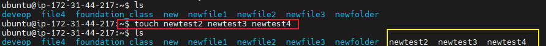

FILE MANIPULATION
# 1. `Sudo command`: 

Sudo command in Linux stands for `Super User Do or Subtitude user Do`. Sudo is a command in Linux that allows users to run commands with priviledges that only `root user have`.

sudo (Super User DO) command in Linux is generally used as a prefix for some commands that only superusers are allowed to run. If you prefix any command with “sudo”, it will run that command with elevated privileges or in other words allow a user with proper permissions to execute a command as another user, such as the superuser. This is the equivalent of the “run as administrator” option in Windows. The option of sudo lets us have multiple administrators.
Example of Sudo command is the installation of a package or the upgrade of the system as shown below with command: 

`sudo apt upgrade`

# 2. pwd command:
The pwd command in Linux stands for print working directory. It is used to display the current working directory in the terminal. The command prints the complete path of the current working directory, starting from the root directory

The example is as shown below;

# 3. cd command:
cd command in Linux known as the change directory command. It is used to move efficiently from the current working directory to different directories in our System

The example and the output of cd command is as shown below.

cd [option]

cd [diretory]
cd deveop as seen the screen shot below

# 4. ls command:
s is a Linux shell command that lists directory contents of files and directories. It provides valuable information about files, directories, and their attributes.

The example is as shown below

`ls /home/ubu/Desktop`

# 5. cat command:

The 'cat' command is the most universal and powerful tool. It is considered to be one of the most frequently used commands. It can be used to display the content of a file, copy content from one file to another, concatenate the contents of multiple files, display the line number, display $ at the end of the line, etc.

The example is as shown below;

`cat > newfile`

# 6. cp command:
The Linux cp command. You use the cp command in Linux to copy files and directories from one location to another. It stands for "copy" and is a fundamental command-line utility for file management. The cp command follows a specific syntax for copying directories.

The example is as show below;

`cp [option]`

# 7. mv command
The mv command moves files and directories from one directory to another or renames a file or directory. If you move a file or directory to a new directory, it retains the base file name. When you move a file, all links to other files remain intact, except when you move it to a different file system.

Example is as shown below

# 8. mkdir
The Linux mkdir command is used in Linux to create a new directory. You can also do this with a graphical file manager but if you work with commands often, this one will become very important. Linux mkdir is one of the most important and widely used commands for all common Linux distributions, as well as Ubuntu.

The example is as shown below 

# 9. rmdir
The rmdir command removes the directory, specified by the Directory parameter, from the system. The directory must be empty before you can remove it, and you must have write permission in its parent directory. Use the ls -al command to check whether the directory is empty.

The example is as shown below

# 10. rm command
The rm command removes the entries for a specified file, group of files, or certain select files from a list within a directory. User confirmation, read permission, and write permission are not required before a file is removed when you use the rm command.

The example is as shown below

# 11. touch command:
The touch command in Linux is used to create a new empty file and to change the timestamps of existing files. You can use it with the syntax: touch myfile. txt . In this example, we use the touch command to create a new file named 'myfile

The example is as shown below

# 12. locate command
The basic use of the 'locate' command in Linux is straightforward. It's used to find files by their name. The command searches through a prebuilt database of files and directories in your system, returning matches based on your input.

The example is as shown below

# 13. find command
To find a file in Linux, you can use the Linux find command. This starts a recursive search, where a directory hierarchy is searched following certain criteria. The Linux find command is a precise tool for finding files and directories and is supported across pretty much all Linux distributions.

The example is as shown below

# 14. grep command
The grep command is a filter that is used to search for lines matching a specified pattern and print the matching lines to standard output. The pattern is specified as a regular expression. A regular expression is a string of characters that is used to specify a pattern matching rule.

The example is as shown below

# 15. df command
The df command displays information about total space and available space on a file system. The FileSystem parameter specifies the name of the device on which the file system resides, the directory on which the file system is mounted, or the relative path name of a file system.

The example is as shown below

# 16. du command
The 'du' command in Linux is used to estimate file and directory space usage. It is used with the syntax, du [filename or path/to/directory] . In this example, we use the 'du' command followed by the path of the directory we want to check

The example is as shown below

# 17. head command
The Linux head command prints the first lines of one or more files (or piped data) to standard output. By default, it shows the first 10 lines. However, head provides several arguments you can use to modify the output. Read on to learn how to use the head command, its syntax, and options with easy-to-follow examples.

The example is as shown below

# 18. tail command
The Linux tail command is an essential tool for the command line. The command is primarily used to output the end of a (text) file or to limit the output of a Linux command.

The example is as shown below

# 19. diff command
diff is a command-line utility that allows you to compare two files line by line. It can also compare the contents of directories. The diff command is most commonly used to create a patch containing the differences between one or more files that can be applied using the patch command.

# 20. tar command
The tar command is short for tape archive in Linux. This command is used for creating Archive and extracting the archive files. In Linux, it is one of the essential commands which facilitate archiving functionality.

The example is as shown below

# 21. chmod
The chmod, or change mode, command allows an administrator to set or modify a file's permissions. Every UNIX/Linux file has an owner user and an owner group attached to it, and every file has permissions associated with it

The example is as shown below

# 22 chown
The chown command changes the owner of a file, and the chgrp command changes the group. On Linux, only root can use chown for changing ownership of a file, but any user can change the group to another group he belongs to. The plus sign means “add a permission,” and the x indicates which permission to add.

The example is as shown below

# 23. jobs command

The jobs command reports the status of background processes that are currently running, based on the job identifier; it also reports on the status of stopped processes and completed processes. If you use the -l option, you can display both the job identifier and the PID for the process.

The example is as shown below

# 24. kill command

Once the process you wish to terminate is located, you can use the killall, pkill, kill, xkill, or top commands to end it. You can use the SIGHUP, SIGKILL, or SIGTERM termination signals to initiate the Linux kill process

The example is as shown below

# 26. ping command

The Linux ping command is a tool for testing connectivity and system availability. It is pre-installed in most Linux distributions and accessible via Terminal or an SSH client. It involves sending ICMP packets to a destination machine using its hostname, domain, or IP address.

The example is as shown below

# 26. wget command

Wget (short for World Wide Web Get) is an open-source utility that allows you to retrieve content from web servers via HTTP, HTTPS, and FTP protocols. It is designed for non-interactive downloads, meaning it can operate in the background without user input, making it great for scheduled downloads.

# 27. uname command

The uname command in Linux is a powerful tool for displaying system information. At its most basic level, it can be used without any options to display the name of the operating system. In this example, the uname command is used without any options.

# 28. tar command

The tar command is short for tape archive in Linux. This command is used for creating Archive and extracting the archive files. In Linux, it is one of the essential commands which facilitate archiving functionality.

The example is as shown below

# 29 history command
The history command in Linux is a built-in shell tool that displays a list of commands used in the terminal session. history allows users to reuse any listed command without retyping it

# 30. man command
man command in Linux is used to display the user manual of any command that we can run on the terminal. It provides a detailed view of the command which includes NAME, SYNOPSIS, DESCRIPTION, OPTIONS, EXIT STATUS, RETURN VALUES, ERRORS, FILES, VERSIONS, EXAMPLES, AUTHORS and SEE ALSO.

# 31. echo command

The echo command in Linux is a built-in command that allows users to display lines of text or strings that are passed as arguments. It is commonly used in shell scripts and batch files to output status text to the screen or a file.
 
 # 32. zip,unzip command
 ## zip: 
 Zip is used to compress files to reduce file size and is also used as a file package utility. Zip is available in many operating systems like Unix, Linux, windows, etc.
 ## unzip   
 You can use the command unzip archive. zip in your terminal in Linux if you are at the location where the zipped file is present. Or, you can use the -d option to unzip it from anywhere by providing the specific path

 # 33. Hostname command
 Hostname is the program that is used to either set or display the current host, domain or node name of the system. These names are used by many of the networking programs to identify the machine.

 The example is as shown below

 

 # 34. useradd and userdel command

 ## useradd
 useradd is a command in Linux that is used to add user accounts to your system

 ## userdel
 useradd is a command in Linux that is used to delete user accounts to your system

# 35 apt-get command
apt-get is a command-line tool that helps in handling packages in Linux. Its main task is to retrieve the information and packages from the authenticated sources for installation, upgrade, and removal of packages along with their dependencies.

# 36 nano,vi,jed command

## nano

To use the nano command in Linux, you simply type 'nano' followed by the filename. The basic syntax for use is, nano [options] filename This command opens the specified file in the nano text editor. If the file doesn't exist, nano will create it for you.

## vi
Vi is a screen editor for Linux, Unix and other Unix-like operating systems. Pronounced (vee-aye), vi stands for visual instrument. It is a widely-used default text editor for Unix-based systems and is shipped with vitually all versions of Unix

## jed
ED is a text editor that makes extensive use of the S-Lang library. It is highly cross-platform compatible; JED runs on Windows and all flavors of Linux and Unix. Older versions are available for DOS

# 37 alias, unalias command

## alias
An alias in Linux is a user-defined shortcut for a command or a group of commands. You can create an alias using the 'alias' command followed by the name of the alias and the command it should execute.

## unalias
The unalias command removes the definition for each alias name specified, or removes all alias definitions if the -a flag is used. Alias definitions are removed from the current shell environment.

# 38 su command
The su command is used to switch to another user, in other words change user ID during a normal login session (that is why it is sometimes referred to as switch (-) user by a number of Linux users). If executed without a username, for example su - , it will login as root user by default. it also perform other elevating function that normal user could not do.

# 39 htop command
The htop command in Linux is a powerful tool used to monitor system processes in real-time. It is used by simply entering htop into your Linux terminal.

# 40 ps command
he ps command writes the status of active processes and if the -m flag is given, displays the associated kernel threads to standard output. While the -m flag displays threads associated with processes using extra lines, you must use the -o flag with the THREAD field specifier to display extra thread-related columns.
